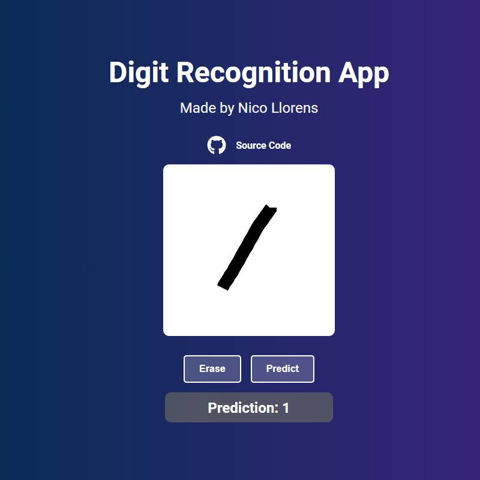
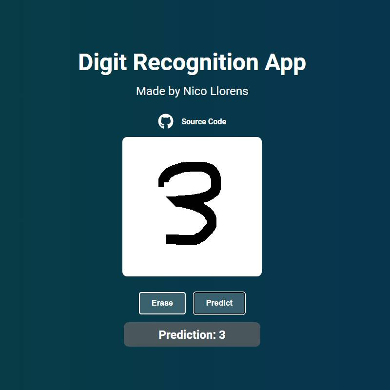
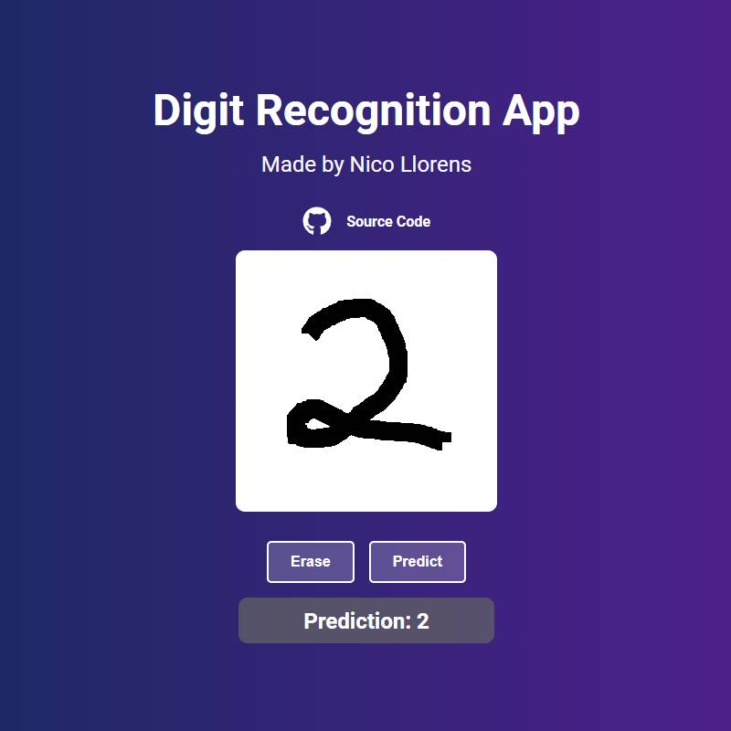
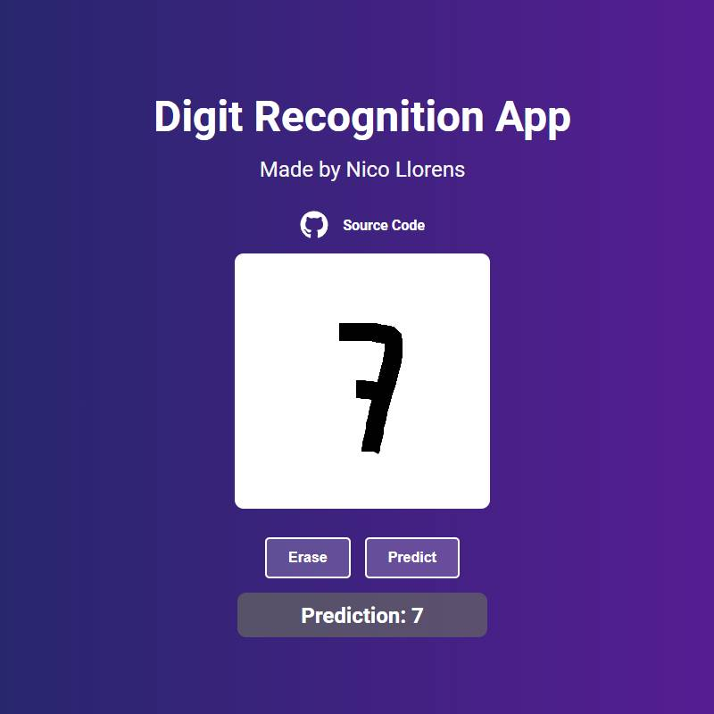

:construction: This project is still under testing, several improvements are expected on the future :construction:

## Information

This project is divided in 3 folders:

- [`Dev`](https://github.com/nicollorens12/DigitRecognition/tree/main/Dev): Training and study of the model and data.
- [`Lambda`](https://github.com/nicollorens12/DigitRecognition/tree/main/Lambda): The code for the a CustomNeuralNetwork to be loaded,process the image to be similar as MNIST dataset one and then let the model predict the drawn digit. This is deployed on AWS Lambda service.
- [`Web`](https://github.com/nicollorens12/DigitRecognition/tree/main/Web): Made with NextJS, the simple, one-page website for sending to an API Gateway that then redirect the event to the Lambda a 280x280 drawing of a digit and showing the result.

## Motivation

As part of my journey on learning more about Data Science and DL, I wanted to learn how NN work exactly and how to used them.

I read a lot, about how NN worked but the best resource I found was [3Blue1Brown NN Playlist](https://www.youtube.com/watch?v=aircAruvnKk&list=PLZHQObOWTQDNU6R1_67000Dx_ZCJB-3pi&ab_channel=3Blue1Brown).

After understanding how NN, Gradient Descent and backpropagation work, I tried to implement a simple NN class that could help me solve a handwritten digit recognition problem.

I used the [MNIST Handwritten Digits](https://www.kaggle.com/datasets/hojjatk/mnist-dataset) dataset.

Study.ipynb, is just now a way to understand the Dataset and create a first simple instance to see what's the overall performance.

## Future Improvements

- Improve overall digit prediction on the website as it's different handwritten than drawn with a mouse. Maybe add a feedback option on the prediction to create more instances for the dataset so the model can be improved for digits written with a mouse/trackpadd.
- Add a Fine Tunning section to Study.ipynb as I think more improvements can be made to enhance performance of the model.

## Website Images

